# Báo cáo thực hành Lab 1

| Thông tin     | Chi tiết                                     |
| ------------- | -------------------------------------------- |
| **Họ và tên** | Phạm Viết Đức                                |
| **MSSV**      | 23520314                                     |
| **Môn học**   | IE213.Q21 - Kỹ thuật phát triển hệ thống Web |
| **GVHD**      | ThS. Võ Tấn Khoa                             |

---

## Tổng quan bài thực hành

- **Mục tiêu bài thực hành:** Thiết lập môi trường và thực hành viết lệnh MongoDB.
- **Công cụ / môi trường sử dụng:** MongoDB Atlas (DBaaS), MongoDB Compass (GUI Client) và MONGOSH.
- **Cách chạy:** 
  1. Mở kết nối cluster tới MongoDB Compass.
  2. Bật công cụ `>_ mongosh` (nằm ở dưới cùng Compass) và chạy tuần tự các câu lệnh `main.sql` (hoặc dán trực tiếp).
- **Kết quả đầu ra:** Database \`23520314-IE213\` cùng collection \`employees\` được khởi tạo thành công. Các query filter, update, aggregation thao tác trực tiếp trên Mongo Shell đều trả về đúng dữ liệu theo từng yêu cầu bài lab (dưới đây là ảnh chụp minh chứng).
- **Giải thích ngắn gọn phần chính đã thực hiện:** 
  - **Bài 1:** Đăng ký và kết nối Cluster, nạp data mẫu để tạo ra môi trường làm việc Cloud.
  - **Bài 2:** Sử dụng các lệnh CRUD như `insertMany` để thêm data, `createIndex` để chống trùng field, `find` với operator `$gt`, `$lt` để lọc và tìm kiếm; dùng `updateMany` kết hợp `$set`, `$unset` cập nhật dữ liệu; và sử dụng Pipeline `aggregate` với `$match`, `$group` để nhóm tính toán độ tuổi trung bình.

---
## 1.1 Đăng ký tài khoản MongoDB Atlas và tạo cluster miễn phí trên dịch vụ đám mây.

**Giải thích:** Tạo tài khoản trên MongoDB Atlas và khởi tạo một cluster miễn phí để lưu trữ database trên cloud.

**Minh chứng:**
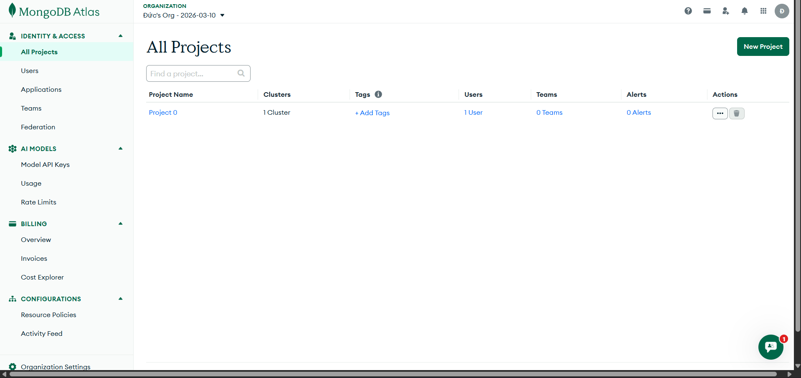

## 1.2 Tìm nạp dữ liệu mẫu trên MongoDB Atlas vào cluster.

**Giải thích:** Sử dụng chức năng Load Sample Dataset để nạp bộ dữ liệu mẫu của MongoDB vào cluster.

**Minh chứng:**
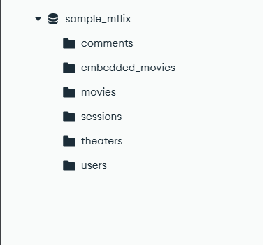

## 1.3 Cài đặt MongoDB Compass trên máy tính.

**Giải thích:** Tải và cài đặt phần mềm MongoDB Compass làm công cụ quản lý database bằng giao diện trực quan.

**Minh chứng:**
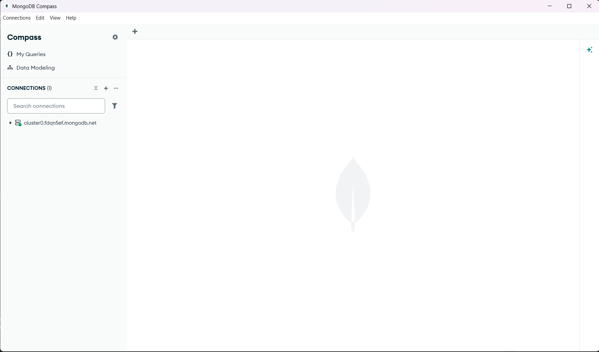

## 1.4 Kết nối MongoDB Compass với cluster đã tạo trên MongoDB Atlas.

**Giải thích:** Sử dụng chuỗi kết nối (URI) từ Atlas vào Compass để thiết lập liên kết từ máy tính đến cloud.

**Minh chứng:**
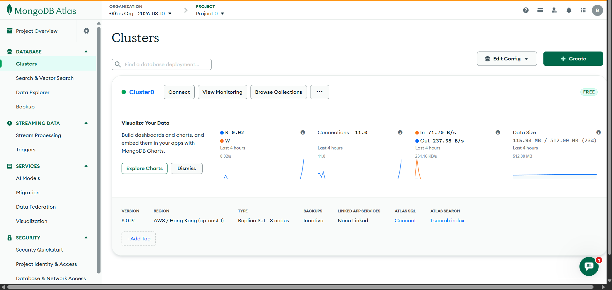
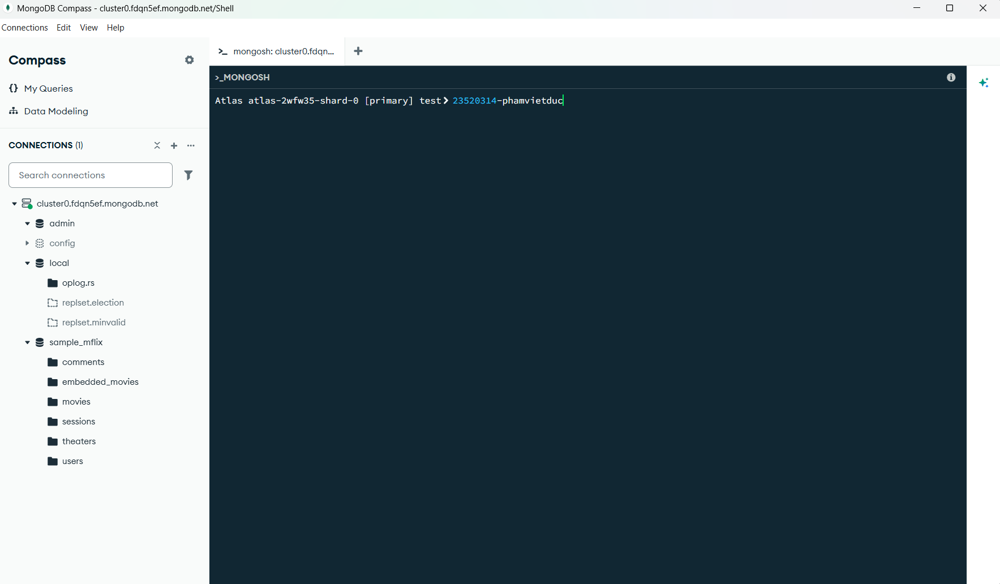

## 2.1 Tạo cơ sở dữ liệu có tên MSSV-IE213 trên cluster của bạn (trong đó MSSV là mã số sinh viên của bạn).

**Code:**

```sql
use 23520314-IE213
```

**Giải thích:** Chuyển đổi (và tự động tạo mới) cơ sở dữ liệu với tên gọi chứa mã số sinh viên.

**Minh chứng:**
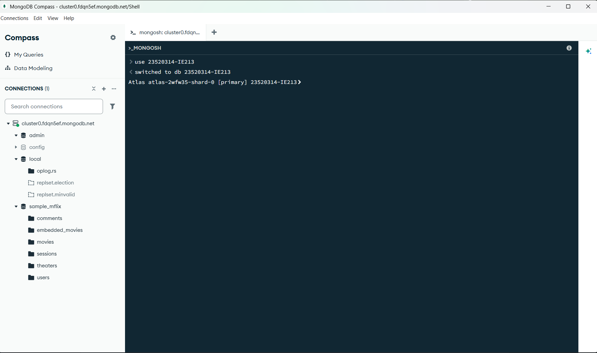

## 2.2 Thêm các document sau đây vào collection có tên là employees trong db vừa được tạo ở trên:

`{"id":1,"name":{"first":"John","last":"Doe"},"age":48}`
`{"id":2,"name":{"first":"Jane","last":"Doe"},"age":16}`
`{"id":3,"name":{"first":"Alice","last":"A"},"age":32}`
`{"id":4,"name":{"first":"Bob","last":"B"},"age":64}`

**Code:**

```sql
db.employees.insertMany([
  {id:1, name:{first:"John", last:"Doe"}, age:48},
  {id:2, name:{first:"Jane", last:"Doe"}, age:16},
  {id:3, name:{first:"Alice", last:"A"}, age:32},
  {id:4, name:{first:"Bob", last:"B"}, age:64}
])
```

**Giải thích:** Sử dụng lệnh `insertMany` để chèn danh sách các object (document) thông tin nhân viên vào collection `employees`.

**Minh chứng:**
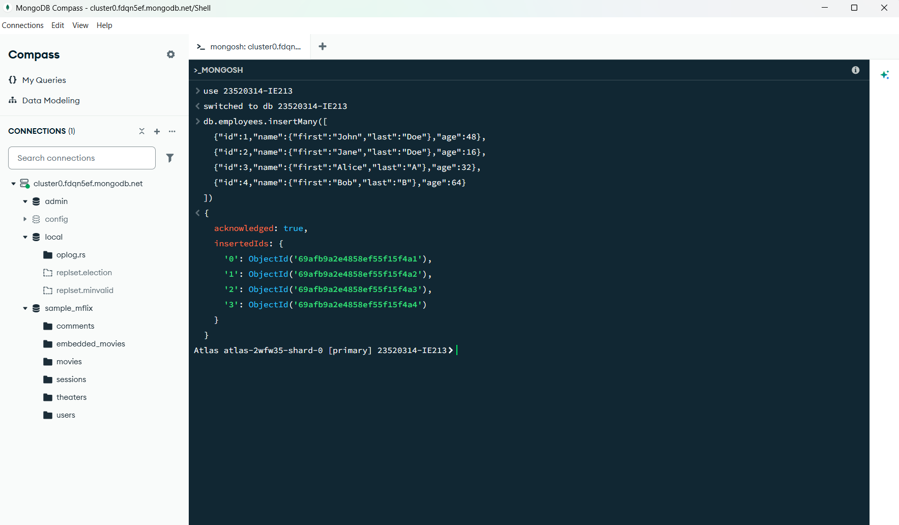

## 2.3 Hãy biến trường id trong các document trên trở thành duy nhất. Có nghĩa là không thể thêm một document mới với giá trị id đã tồn tại.

**Code:**

```sql
db.employees.createIndex({id:1}, {unique:true})
```

**Giải thích:** Tạo chỉ mục (Index) với tùy chọn `unique: true` trên trường `id` để ngăn chặn việc chèn trùng lặp mã nhân viên.

**Minh chứng:**
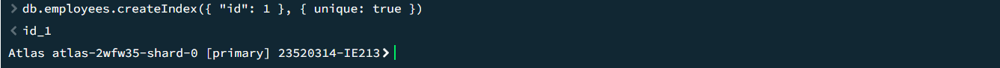

## 2.4 Hãy viết lệnh để tìm document có firstname là John và lastname là Doe.

**Code:**

```sql
db.employees.find({
  "name.first": "John",
  "name.last": "Doe"
})
```

**Giải thích:** Dùng lệnh `find` để truy vấn chính xác dữ liệu bên trong sub-document (`name.first` và `name.last`).

**Minh chứng:**
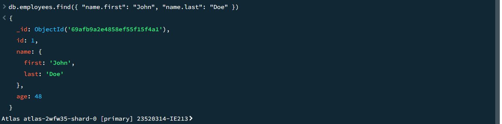

## 2.5 Hãy viết lệnh để tìm những người có tuổi trên 30 và dưới 60.

**Code:**

```sql
db.employees.find({
  age: {$gt:30, $lt:60}
})
```

**Giải thích:** Dùng lệnh `find` kết hợp với toán tử so sánh `$gt` (> 30) và `$lt` (< 60) để lọc dữ liệu theo khoảng giá trị tuổi.

**Minh chứng:**
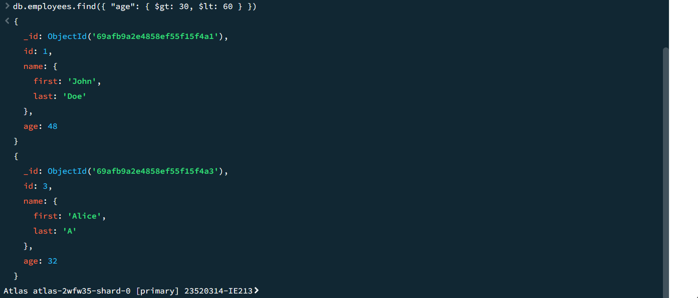

## 2.6 Thêm các document sau đây vào collection:

`{"id":5,"name":{"first":"Rooney", "middle":"K", "last":"A"},"age":30}`
`{"id":6,"name":{"first":"Ronaldo", "middle":"T", "last":"B"},"age":60}`
Sau đó viết lệnh để tìm tất cả các document có middle name.

**Code:**

```sql
db.employees.insertMany([
  {id:5, name:{first:"Rooney", middle:"K", last:"A"}, age:30},
  {id:6, name:{first:"Ronaldo", middle:"T", last:"B"}, age:60}
])

db.employees.find({
  "name.middle": {$exists:true}
})
```

**Giải thích:** Chèn thêm document có trường `name.middle`, sau đó dùng lệnh `find` kết hợp toán tử `$exists: true` để tìm những người có trường này.

**Minh chứng:**
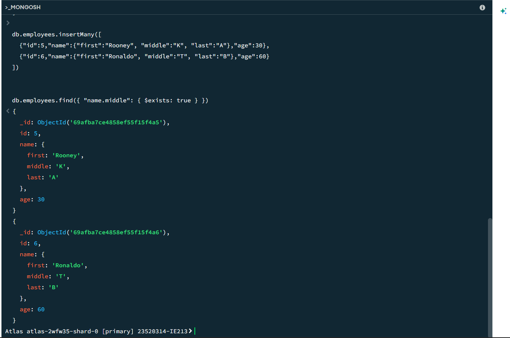

## 2.7 Cho rằng là những document nào đang có middle name là không đúng, hãy xoá middle name ra khỏi các document đó.

**Code:**

```sql
db.employees.updateMany(
  {"name.middle": {$exists:true}},
  {$unset: {"name.middle": ""}}
)
```

**Giải thích:** Dùng lệnh `updateMany` kết hợp toán tử `$unset` để xóa bỏ hoàn toàn trường `name.middle` ra khỏi các document thỏa điều kiện.

**Minh chứng:**
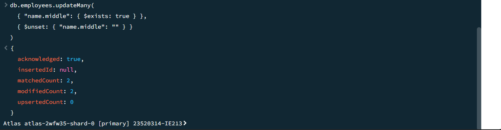

## 2.8 Hãy thêm trường dữ liệu organization: "UIT" vào tất cả các document trong employees collection.

**Code:**

```sql
db.employees.updateMany(
  {},
  {$set: {organization: "UIT"}}
)
```

**Giải thích:** Triển khai lệnh `updateMany` với bộ lọc rỗng `{}` và toán tử `$set` để thêm/cập nhật trường `organization` cho tất cả document.

**Minh chứng:**
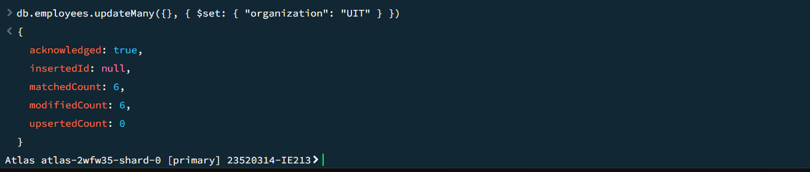

## 2.9 Hãy điều chỉnh organization của nhân viên có id là 5 và 6 thành "USSH".

**Code:**

```sql
db.employees.updateMany(
  {id: {$in: [5,6]}},
  {$set: {organization: "USSH"}}
)
```

**Giải thích:** Dùng toán tử `$in` để gom nhóm điều kiện `id` (5,6) và dùng `$set` để thay đổi giá trị `organization` của họ.

**Minh chứng:**
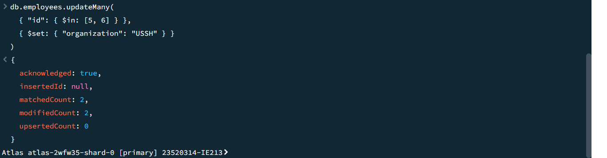

## 2.10 Hãy viết lệnh để tính tổng tuổi và tuổi trung bình của nhân viên thuộc 2 organization là UIT và USSH.

**Code:**

```sql
db.employees.aggregate([
  {
    $match: {
      organization: {$in: ["UIT", "USSH"]}
    }
  },
  {
    $group: {
      _id: "$organization",
      totalAge: {$sum: "$age"},
      averageAge: {$avg: "$age"}
    }
  }
])
```

**Giải thích:** Chuyển đổi (và tự động tạo mới) cơ sở dữ liệu với tên gọi chứa mã số sinh viên.

**Giải thích:** Thiết lập Aggregation Pipeline bao gồm stage `$match` để lọc dữ liệu và stage `$group` dùng biến `$sum`, `$avg` để tính toán tổng và trung bình tuổi.

**Minh chứng:**
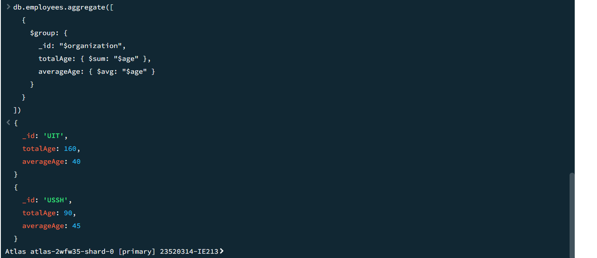

## Khai báo sử dụng AI trí tuệ nhân tạo

- Dùng AI để hỗ trợ viết code SQL
