# Báo cáo thực hành Lab 2

| Thông tin     | Chi tiết                                     |
| ------------- | -------------------------------------------- |
| **Họ và tên** | Phạm Viết Đức                                |
| **MSSV**      | 23520314                                     |
| **Môn học**   | IE213.Q21 - Kỹ thuật phát triển hệ thống Web |
| **GVHD**      | ThS. Võ Tấn Khoa                             |

---

## Tổng quan bài thực hành

- **Mục tiêu bài thực hành:** Thiết lập backend với Node và ExpressJS cho ứng dụng Movie Reviews.
- **Công cụ / môi trường sử dụng:** NodeJS, npm, Express, MongoDB, dotenv, nodemon, Visual Studio Code.
- **Cách chạy:**
  1. Mở thư mục chứa dự án `movie-reviews/backend` trong terminal.
  2. Cài đặt các dependency cần thiết bằng lệnh `npm install`.
  3. Khởi động máy chủ bằng lệnh `node index.js` hoặc `nodemon index.js` (hoặc cấu hình lệnh start trong package.json).
- **Kết quả đầu ra:** Server chạy thành công và lắng nghe kết nối trên cổng được khai báo (ví dụ PORT 8000), có khả năng nhận các HTTP request và trả về dữ liệu cho máy khách từ truy vấn CSDL (thông qua DAO).
- **Giải thích ngắn gọn phần chính đã thực hiện:**
  - **Bài 1:** Cài đặt các công cụ cần thiết như NodeJS, trình soạn thảo, khởi tạo cấu trúc dự án (`npm init`) và cài đặt các thư viện lõi gồm `mongodb`, `express`, `cors`, `dotenv`, `nodemon`.
  - **Bài 2:** Triển khai mã nguồn máy chủ Web Server. Xây dựng `server.js` cấu hình Express, tạo cấu hình biến môi trường `.env`, điểm khởi đầu `index.js` nối CSDL, xây dựng DAO (`moviesDAO.js`) để truy xuất dữ liệu MongoDB và Controller (`movies.controller.js`), Router (`movies.route.js`) để quản lý luồng các request từ Client.

---

## 1.1 Tải và cài đặt nodejs – nodejs.org

**Giải thích:** Cài đặt môi trường thực thi NodeJS để có thể chạy JavaScript ở phía máy chủ, kiểm tra việc cài đặt thành công qua lệnh `node -v` trên giao diện command line.

**Minh chứng:**
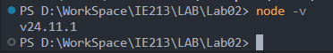

## 1.2 Tải và cài đặt trình soạn thảo VS Code / Sublime Text

**Giải thích:** Cài đặt công cụ soạn thảo trực quan hỗ trợ viết và quản lý mã nguồn dự án dễ dàng hơn.

**Minh chứng:**

## 1.3 Khởi tạo cây thư mục chứa mã nguồn của dự án (movie-reviews/backend)

**Giải thích:** Tạo không gian làm việc cơ bản ban đầu để lưu trữ mã nguồn và các file cấu hình, chuẩn bị cho việc xây dựng kiến trúc RESTful Backend.

**Minh chứng:**
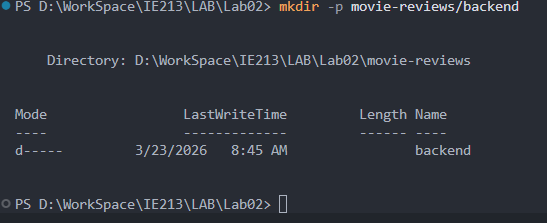

## 1.4 Khởi tạo dự án với câu lệnh npm init

**Giải thích:** Chạy lệnh `npm init` để sinh ra tệp cấu hình `package.json`, nơi định nghĩa phần thông tin mô tả và lưu lại danh sách thư viện của dự án.

**Minh chứng:**
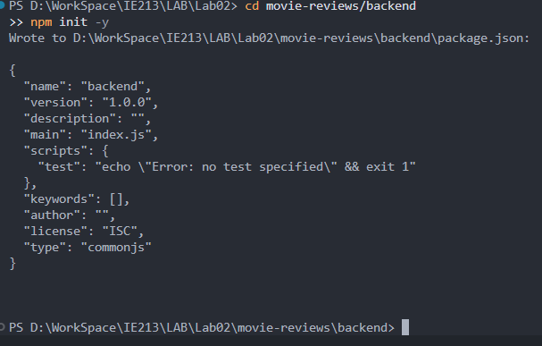

## 1.5 Cài đặt một số dependency của dự án như mongodb, express, cors, dotenv

**Giải thích:** Chạy lệnh npm để tải các gói thư viện quan trọng: `express` cho web framework, `mongodb` kết nối CSDL, `cors` để cấp quyền cross-origin resource sharing, và `dotenv` tải biến môi trường.

**Minh chứng:**
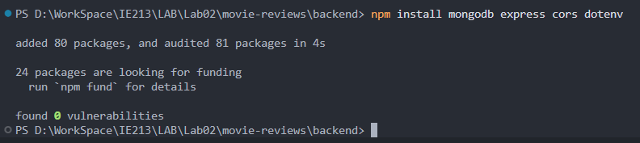

## 1.6 Cài đặt nodemon – công cụ giúp khởi động lại máy chủ web

**Giải thích:** Thêm tiện ích nodemon giúp tiết kiệm thời gian, tự động cập nhật và khởi động lại server mỗi khi nhận diện được sự thay đổi của các file code.

**Minh chứng:**
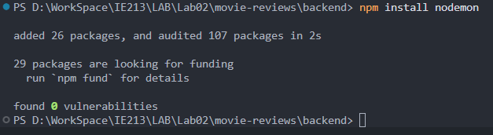

## 2.1 Tạo tệp tin server.js là nơi khởi tạo máy chủ web

**Giải thích:** Khởi tạo instance của express (`app = express()`), dùng `cors` và `express.json()` làm middleware cũng như cầu nối định tuyến ban đầu (ví dụ báo lỗi đường dẫn 404).

**Minh chứng:**
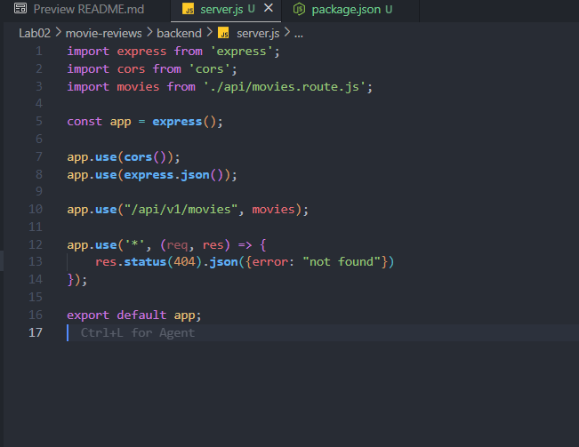

## 2.2 Tạo tệp tin .env để lưu trữ thông tin biến môi trường phát triển

**Giải thích:** Khai báo một số thông số nhạy cảm và quan trọng để tách bạch khỏi code logic, bao gồm đường link kết nối MongoDB (`MOVIEREVIEWS_DB_URI`), và cổng listen của server `PORT`.

**Minh chứng:**
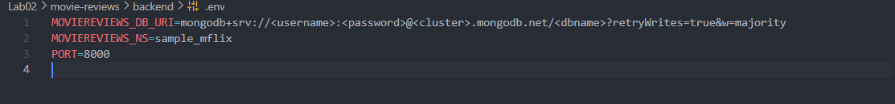

## 2.3 Tạo tệp tin index.js để quản lý việc kết nối dữ liệu

**Giải thích:** Thiết lập file khởi chạy chính của ứng dụng, nạp file cấu hình từ `.env`, tạo Client liên kết với cluster MongoDB và bắt đầu cho `app` listen trên cổng khai báo.

**Minh chứng:**
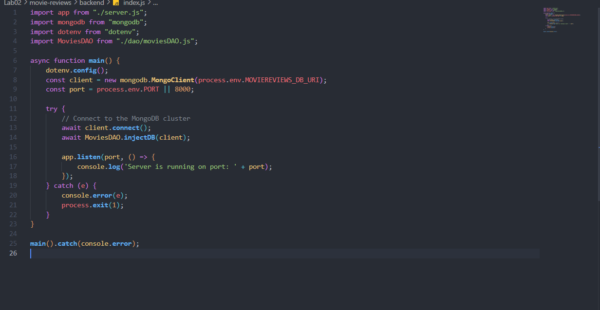

## 2.4 Tạo thư mục và tệp tin api/movies.route.js để xử lý các định tuyến

**Giải thích:** Định nghĩa `express.Router()` cho các endpoint tài nguyên thay vì code mọi thứ ở `server.js`. Ban đầu có thể thiết lập trả lời `'hello world'` khi được truy vấn qua GET method.

**Minh chứng:**
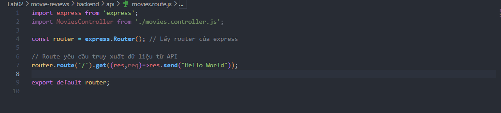

## 2.5 Thiết lập công cụ truy xuất dữ liệu DAO với moviesDAO.js

**Giải thích:** Xây dựng file Data Access Object định nghĩa lớp `MoviesDAO` cùng các phương thức thiết yếu như `injectDB()` để cung cấp kết nối CSDL và `getMovies()` để lọc, lấy danh sách movie ra khỏi DB.

**2.5.1. Tạo tệp tin moviesDAO.js**

**Minh chứng:**
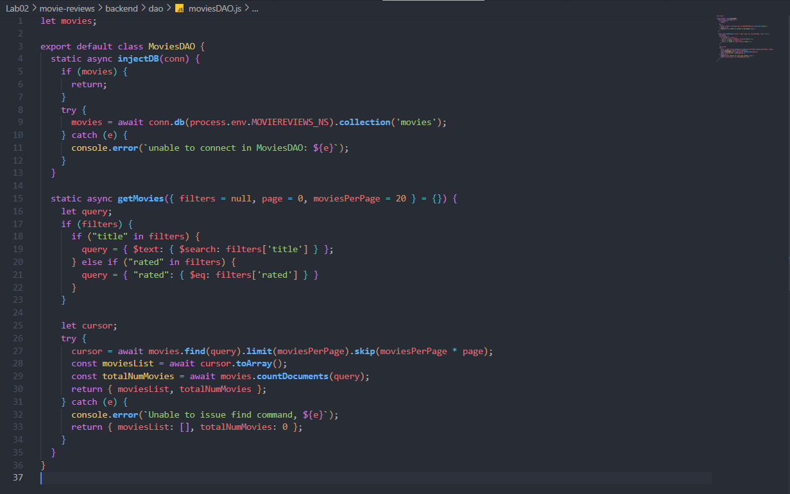

**2.5.2. Khởi tạo đối tượng của lớp MoviesDAO trong tệp tin index.js**

**Minh chứng:**
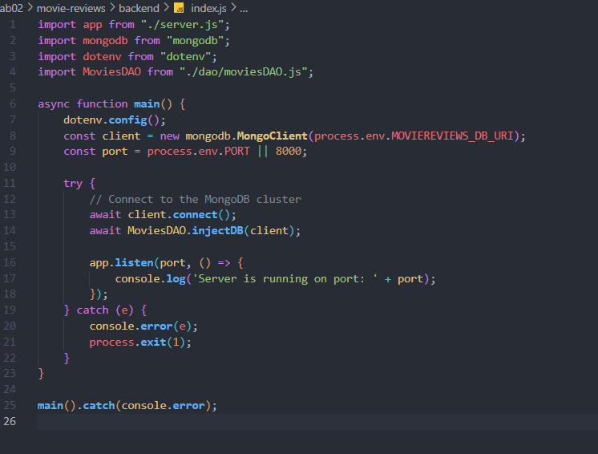

## 2.6 Thiết lập CONTROLLER cho ứng dụng web (movies.controller.js)

**Giải thích:** Đóng vai trò làm tầng xử lý logic tương tác: nhận request của frontend (gồm `page`, `filters`), dùng lớp `MoviesDAO` gọi dữ liệu trả về và format nó dưới dạng JSON thông minh truyền về Client.

**Minh chứng:**

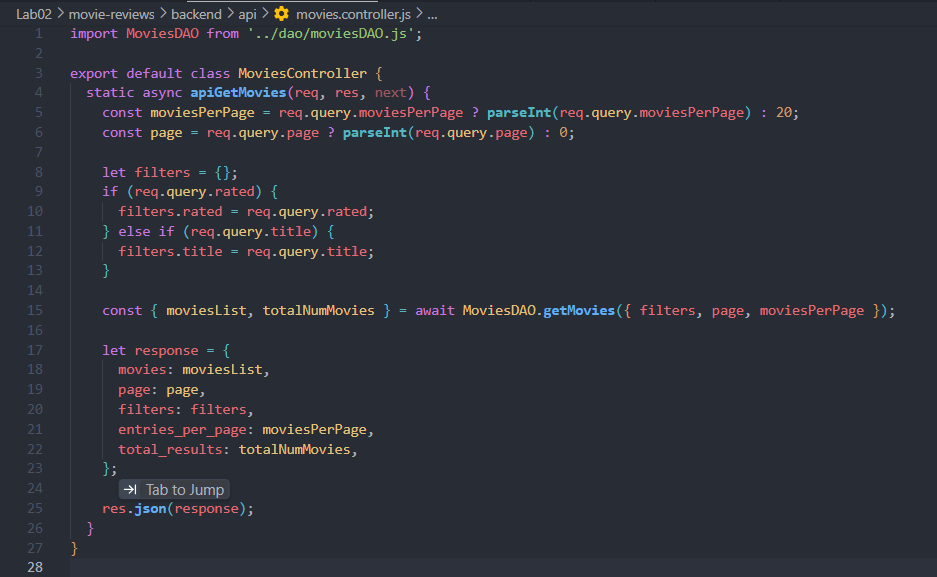

## 2.7 Đưa Controller vào định tuyến movies.route.js

**Giải thích:** Cập nhật lại định tuyến (`/`) để gọi đến hàm `apiGetMovies` ở bên Controller, hoàn thiện luồng gọi dữ liệu MVC hoàn chỉnh của Backend (Browser -> Route -> Controller -> DAO).

**Minh chứng:**
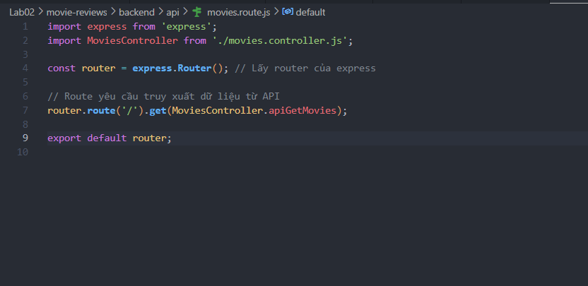

## 3.1 Chạy dự án (Cách chạy project)

**Giải thích:** Thiết lập chính xác file `.env` chứa chuỗi kết nối và thông số cấu hình. Sử dụng lệnh `nodemon index.js` trên Terminal mở tại thư mục `backend` để khởi động máy chủ.

**Minh chứng:**
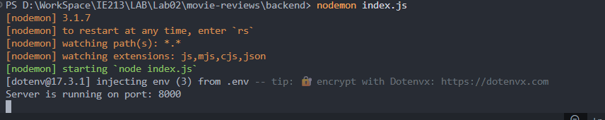

## 3.2 Kết quả đạt được

**Giải thích:** Xây dựng thành công bộ khung Backend dạng MVC với Node và Express. Kết nối trơn tru tới CSDL MongoDB Atlas trên đám mây (không còn bị lỗi IP hay Auth). Server trực chiến tại cổng `8000`, qua đó API Endpoint ở định tuyến `/api/v1/movies` đã sẵn sàng nhận tham số từ Browser hoặc Postman để trả về dữ liệu phim.

**Minh chứng:**
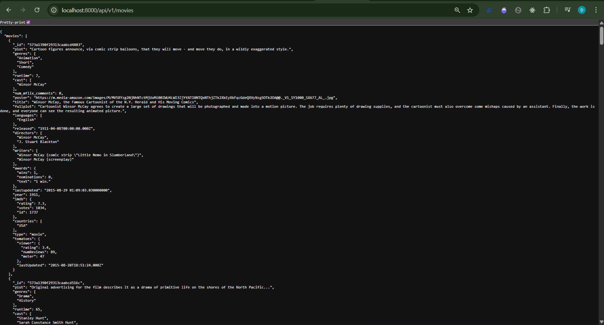

---

## Khai báo sử dụng AI trí tuệ nhân tạo

- Dùng AI để phân tích cấu trúc, yêu cầu đề bài và hỗ trợ soạn thảo báo cáo, tổng kết và giải thích ý nghĩa các công việc thực hành dựa trên mẫu.
