# Báo cáo thực hành Lab 3

| Thông tin     | Chi tiết                                     |
| ------------- | -------------------------------------------- |
| **Họ và tên** | Phạm Viết Đức                                |
| **MSSV**      | 23520314                                     |
| **Môn học**   | IE213.Q21 - Kỹ thuật phát triển hệ thống Web |
| **GVHD**      | ThS. Võ Tấn Khoa                             |

<br>

---

## Tổng quan bài thực hành

- **Mục tiêu bài thực hành:** Hoàn thiện Backend cho ứng dụng Movie Reviews, bao gồm thao tác CRUD với review, lấy thông tin phim chi tiết (kết hợp các bảng) theo ID và trích xuất danh sách loại rating.
- **Công cụ / môi trường sử dụng:** NodeJS, Express, MongoDB, Insomnia/Postman, Visual Studio Code.
- **Cách chạy:**
  1. Mở thư mục chứa dự án `movie-reviews/backend` trong terminal.
  2. Khởi động máy chủ bằng lệnh `nodemon index.js` hoặc `npm start`.
- **Giải thích ngắn gọn phần chính đã thực hiện:**
  - **Bài 1:** Thiết lập định tuyến xử lý các request CRUD (Review).
  - **Bài 2:** Thiết lập logic Controller nhận request từ người dùng.
  - **Bài 3:** Thiết lập tương tác DAO chọc thẳng vào database lưu trữ các đánh giá.
  - **Bài 4:** Khai thác tổng hợp dữ liệu (Aggregation & Lookup) để lấy Movies kèm Reviews và xuất Ratings.

<br>

---

## Bài 1: Thiết lập định tuyến cho các thao tác với review trong ứng dụng minh hoạ

<br>

## 1.1 Định tuyến này sẽ có đường dẫn cuối cùng là ‘/review’

**Giải thích:** Cập nhật tệp tin `movies.route.js` để thiết lập định tuyến có đường dẫn cơ sở `/review`, chuẩn bị đón các luồng request xử lý cho đánh giá.

<br>

## 1.2 Thiết lập định tuyến thêm review vào db thông qua phương thức post

**Giải thích:** Thêm phương thức `.post()` nối vào định tuyến `/review`, gọi đến hàm `apiPostReview` trong lớp `ReviewsController` để tiến hành thêm dữ liệu.

<br>

## 1.3 Thiết lập định tuyến sửa review trên db thông qua phương thức put

**Giải thích:** Thêm phương thức `.put()` nối tiếp theo quy chuẩn REST để hướng các yêu cầu sửa đổi đánh giá đến logic của `apiUpdateReview`.

<br>

## 1.4 Thiết lập định tuyến xoá review trên db thông qua phương thức delete

**Giải thích:** Thêm phương thức `.delete()` phục vụ xóa nội dung, gọi hàm chức năng định sẵn `apiDeleteReview`.

<br>

**Minh chứng:**

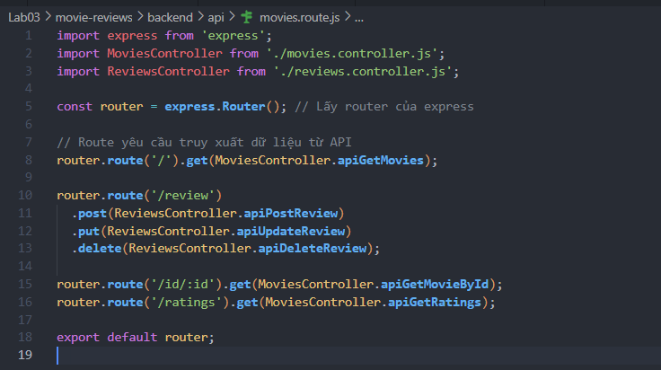

## Bài 2: Thiết lập Controller cho review

<br>

## 2.1 Tạo tệp tin reviews.controller.js trong thư mục api

**Giải thích:** Khởi tạo file mới `reviews.controller.js` chứa lớp điều khiển `ReviewsController` cho tất cả các yêu cầu liên quan đến Review từ máy khách.

**Minh chứng:**

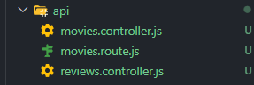

<br>

## 2.2 Import nội dung từ tệp tin reviewsDAO.js

**Giải thích:** Gọi lệnh `import ReviewsDAO from '../dao/reviewsDAO.js'` trong file Controller trên để làm tiền đề truy xuất các hàm thao tác với cơ sở dữ liệu.

**Minh chứng:**

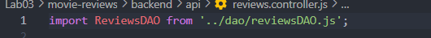

<br>

## 2.3 Tạo phương thức apiPostReview()

**Giải thích:** Hàm có chức năng phân rã thông tin từ request body như `movie_id`, `review`, `user_id`, tạo ngày giờ hiện tại, và gọi DAO thực thi lưu trữ lại DB, "success" nếu thành công, bắt lỗi error (nếu có).

**Minh chứng:**

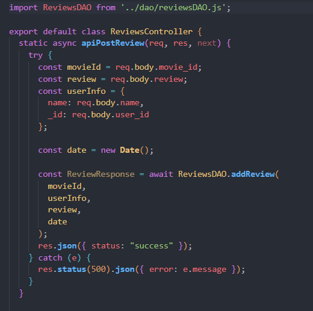

<br>

## 2.4 Tạo phương thức apiUpdateReview()

**Giải thích:** Hàm chịu trách nhiệm lấy `review_id`, thông tin cập nhật rồi gọi đến lớp DAO, kiểm tra biến tổng `modifiedCount` xem review có thực sự được sửa bởi chính chủ hay không.

**Minh chứng:**

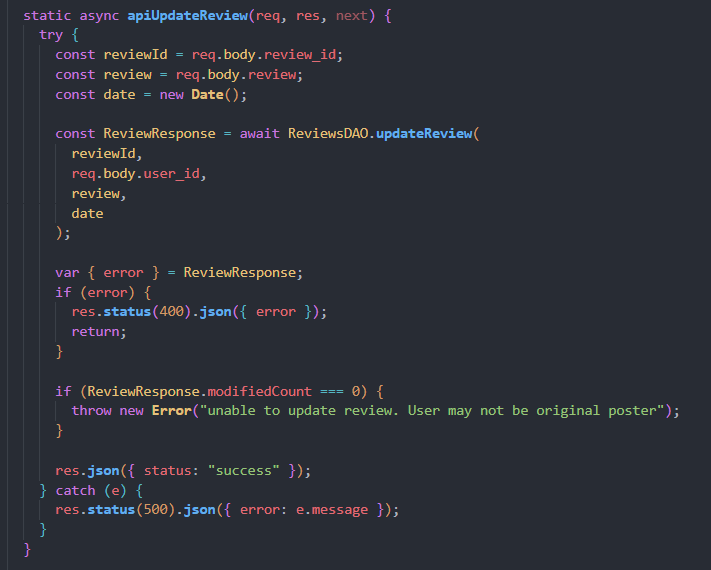

<br>

## 2.5 Tạo phương thức apiDeleteReview()

**Giải thích:** Dùng để quản lý các yêu cầu xoá, lấy ra `review_id` cùng `user_id` từ người gửi yêu cầu loại bỏ và chuyển đi cho DAO xử lý.

**Minh chứng:**

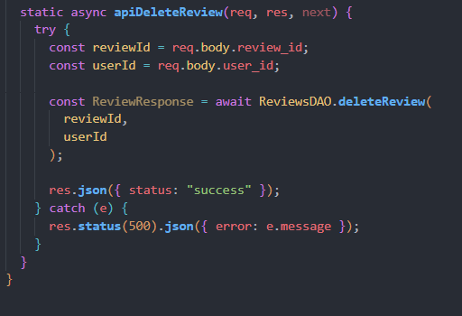

<br>

---

## Bài 3: Thiết lập DAO cho reviews

<br>

## 3.1 Trong thư mục DAO tạo tệp tin reviewsDAO.js

**Giải thích:** Tạo tệp tin và import package `mongodb` cùng biến tham chiếu đối tượng ObjectId và collection `reviews`.

**Minh chứng:**

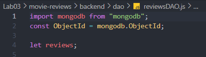

<br>

## 3.2 Tạo phương thức có tên injectDB()

**Giải thích:** Phương thức tĩnh kết nối thông qua Connection Pool cung cấp từ index.js tới instance database, tạo biến thu nhận của collection `'reviews'`. Bổ sung lệnh gọi trong `index.js`.

**Minh chứng:**

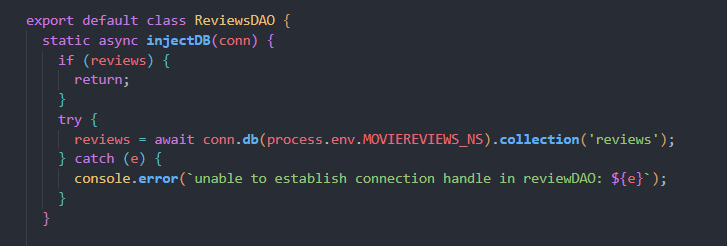

<br>

**Giải thích:** Gọi hàm injectDB trong index.js trước dòng lệnh kết nối

**Minh chứng:**

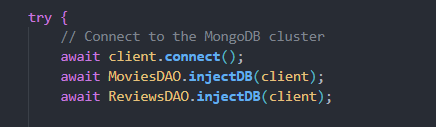

<br>

## 3.3 Tạo phương thức addReview()

**Giải thích:** Hàm lưu trực tiếp mảng thông tin Model bao gồm biến chuỗi `movieId` dưới dạng chuẩn ObjectId của MongoDB vào `reviews` collection thông qua hàm `insertOne`.

**Minh chứng:**

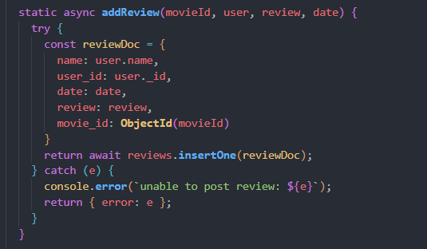

<br>

## 3.4 Tạo phương thức updateReview()

**Giải thích:** Sử dụng hàm `updateOne` kết hợp điều kiện gộp cả `user_id` người dùng và `_id` đánh giá để tiến hành `$set` dữ liệu sửa đổi an toàn.

**Minh chứng:**

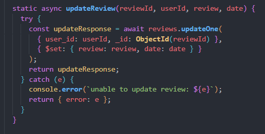

<br>

## 3.5 Tạo phương thức deleteReview()

**Giải thích:** Dùng hàm `deleteOne` cùng thông tin truy vấn gồm `_id` của review và `user_id` để loại bỏ tài liệu chính xác khỏi database.

**Minh chứng:**

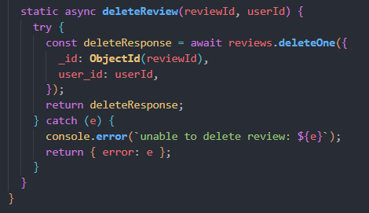

<br>

## 3.6 Thử nghiệm các API xem đã thành công hay chưa bằng Insomnia

**Giải thích:** Tiến hành thực thi test thử các API gửi dữ liệu JSON (body) chứa MSSV làm id người dùng thông qua Postman với đủ thao tác thêm xóa sửa.

**Phương thức POST**
Body :

```json
{
  "movie_id": "<Một_ID_phim_hợp_lệ_từ_DB>",
  "review": "Phim xem rất ấn tượng!",
  "user_id": "23520314",
  "name": "Pham Viet Duc"
}
```

**Minh chứng:**

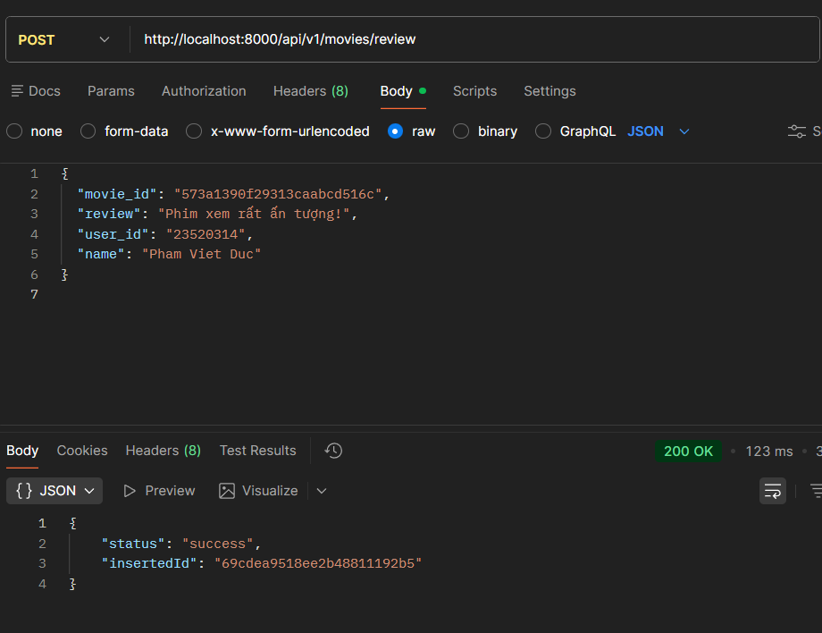

<br>

**Phương thức PUT**
Body :

```json
{
  "review_id": "<ID_của_review_cần_sửa>",
  "user_id": "23520314",
  "review": "Phim xem rất ấn tượng! (Đã cập nhật)"
}
```

**Minh chứng:**

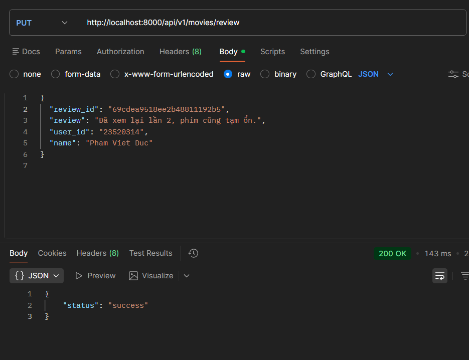

<br>

**Phương thức DELETE**
Body :

```json
{
  "review_id": "<ID_của_review_cần_xóa>",
  "user_id": "23520314"
}
```

**Minh chứng:**

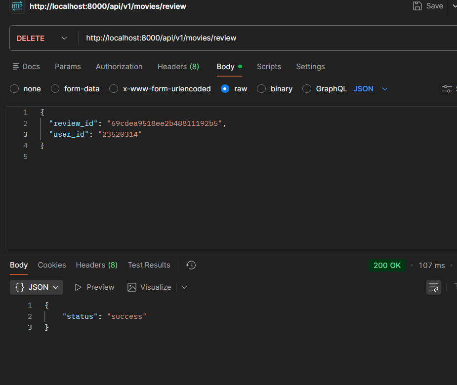

<br>

---

## Bài 4: Hoàn thành back-end cho ứng dụng minh họa

<br>

## 4.1 Thêm 2 định tuyến lấy tất cả thông tin phim kết nối review và danh sách ratings

**Giải thích:** Tại router tổng của ứng dụng cập nhật hai định tuyến GET mới là qua `id/:id` và `/ratings`.

**Minh chứng:**

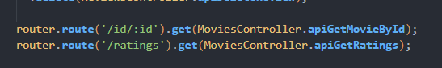

<br>

## 4.2 Thêm 2 phương thức controller apiGetMovieById() và apiGetRatings()

**Giải thích:** Cập nhật `movies.controller.js` hỗ trợ gọi các request trên và nhận dữ liệu mảng hoặc đối tượng thông qua `req.params` rồi trả JSON về client.

**Minh chứng:**

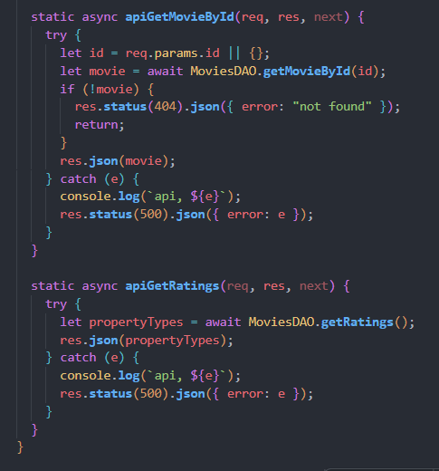

<br>

## 4.3 Thêm 2 phương thức DAO tương ứng là getRatings() và getMovieById()

**Giải thích:** Trong `getMovieById`, đã triển khai hàm pipeline API Aggregation phức tạp gồm `$match` theo ID và `$lookup` đóng vai trò khóa ngoại trích lọc bản ghi bên `reviewsDAO`. Trong khi `getRatings` sử dụng lệnh `distinct` để xuất các phân hạng tuổi.

**Minh chứng:**

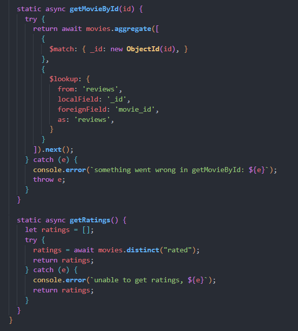

<br>

## 4.4 Thử nghiệm các API vừa tạo ở trên

**Giải thích:** Gửi test HTTP GET request thành công, theo dõi thấy kết quả json trả về chi tiết của phim theo id có chứa thêm danh sách `reviews` hợp lệ và phân hạng mảng ratings minh chứng logic hoạt động trơn tru.

**Lấy phim theo ID (GET):**

**Minh chứng:**

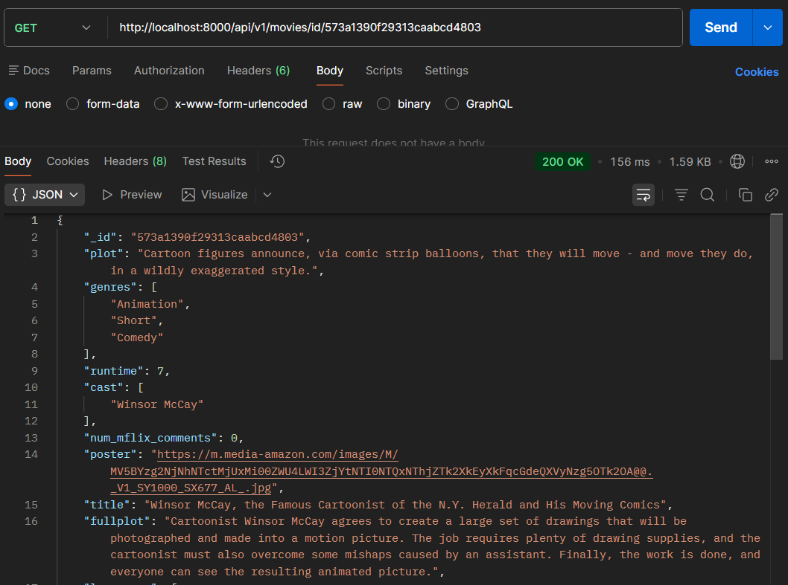

<br>

**Lấy danh sách ratings (GET):**

**Minh chứng:**

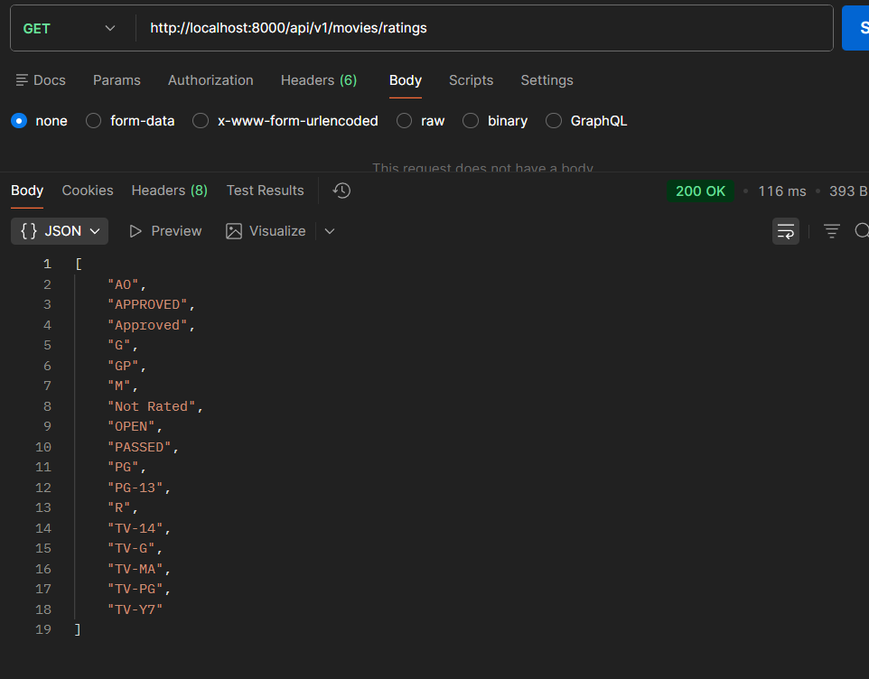

<br>

---

## Khai báo sử dụng AI trí tuệ nhân tạo

- Dùng AI để phân tích cấu trúc, tạo và cập nhật mã nguồn phụ trợ xây dựng Backend CRUD và MongoDB Aggregation trong bài thực hành Lab 3.
- Soạn thảo và chia nhỏ định dạng tài liệu báo cáo Markdown tuân thủ tuyệt đối từng câu hỏi nhỏ của chỉ dẫn yêu cầu.
