# Báo cáo thực hành Lab 4

| Thông tin     | Chi tiết                                     |
| ------------- | -------------------------------------------- |
| **Họ và tên** | Phạm Viết Đức                                |
| **MSSV**      | 23520314                                     |
| **Môn học**   | IE213.Q21 - Kỹ thuật phát triển hệ thống Web |
| **GVHD**      | ThS. Võ Tấn Khoa                             |

<br>

---

## Tổng quan bài thực hành

- **Mục tiêu bài thực hành:** Thiết lập frontend trong MERN stack với Reactjs, giới thiệu các package hỗ trợ, xây dựng Navigation Header bar và thiết lập định tuyến cho các component.
- **Công cụ / môi trường sử dụng:** NodeJS, ReactJS, Bootstrap, React Router DOM, Visual Studio Code.
- **Cách chạy:**
  1. Mở thư mục chứa dự án `frontend` trong terminal.
  2. Khởi động ứng dụng bằng lệnh `npm start`.
- **Giải thích ngắn gọn phần chính đã thực hiện:**
  - **Bài 1:** Khởi tạo template frontend với React và cài đặt các package Bootstrap, React Router DOM.
  - **Bài 2:** Xây dựng Navigation Header bar bằng cách sử dụng Navbar Component từ React-Bootstrap và tùy chỉnh lại logo, các liên kết.
  - **Bài 3:** Thiết lập định tuyến cơ bản trong `App.js` sử dụng thẻ `<Switch>` để chuyển hướng tới các component tương ứng.

<br>

---

## Bài 1: Thiết lập nơi làm việc với frontend của dự án.

<br>

## 1.1 Tạo template frontend với React trong thư mục Movie Review (ứng dụng minh hoạ). Chạy ứng dụng lên với câu lệnh npm start

**Giải thích:** Sử dụng lệnh `npx create-react-app frontend` (hoặc cấu trúc lệnh tương tự) bên trong thư mục dự án Movie Review để tạo khung sườn cho frontend, sau đó chạy `npm start` để khởi động ứng dụng thành công trên trình duyệt.

<br>

**Minh chứng:**

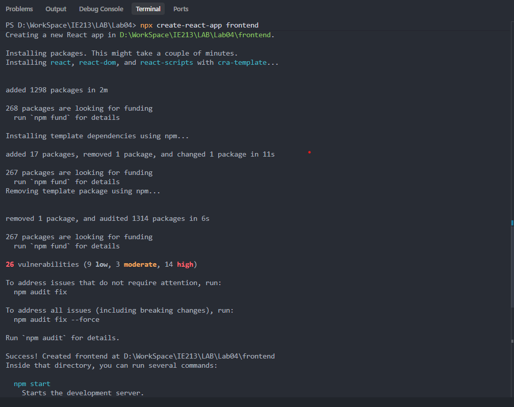
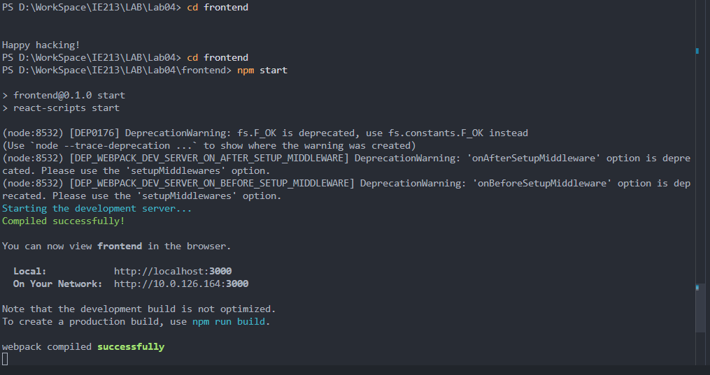

<br>

## 1.2 Cài đặt một số package hỗ trợ xây dựng dự án (Bootstrap, React router dom)

**Giải thích:** Sử dụng trình quản lý gói `npm` để cài đặt thư viện `bootstrap` hỗ trợ xây dựng giao diện UI và `react-router-dom` giúp quản lý định tuyến giữa các trang trong ứng dụng.

<br>

**Minh chứng:**

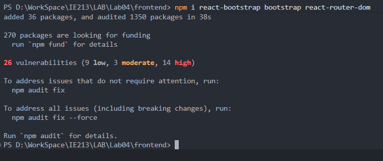

<br>

---

## Bài 2: Xây dựng Navigation Header bar cho ứng dụng.

<br>

## 2.1 Xây dựng các component: movies-list, movie, add-review, login

**Giải thích:** Tạo thư mục `components` bên trong `src` và thêm các file tương ứng (`movies-list.js`, `movie.js`, `add-review.js`, `login.js`) để làm khung hiển thị nội dung giao diện, sau đó sẽ import vào tệp tin `App.js`.

<br>

**Minh chứng:**

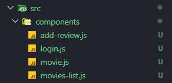

<br>

## 2.2 Lấy Navbar Component từ React-Bootstrap và đưa vào trong phần mã nguồn JSX của function App() trong tệp tin App.js

**Giải thích:** Import `Nav` và `Navbar` từ `react-bootstrap` vào file `App.js`, sau đó đưa đoạn mã JSX giao diện thanh điều hướng Navbar vào bên trong phần trả về cấu trúc HTML/JSX của hàm `<div className="App">`.

<br>

**Minh chứng:**

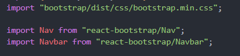
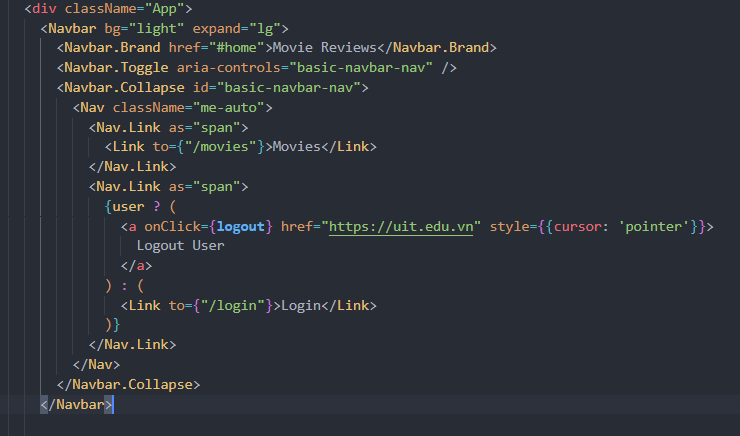

<br>

## 2.3 Điều chỉnh một số thông tin: Tên logo, Liên kết Movies, trạng thái Login/Logout sử dụng React hook useState

**Giải thích:** Sử dụng hook `useState` để lưu trữ đối tượng `user`. Tùy chỉnh chữ trong thẻ `<Navbar.Brand>` thành "Movie Reviews", thay thế liên kết thành thẻ `<Link to={"/movies"}>Movies</Link>`. Tạo luồng rẽ nhánh điều kiện hiển thị trạng thái "Logout User" nếu đã đăng nhập (`user` khác null), ngược lại hiển thị "Login" trỏ đến trang `/login`.

<br>

**Minh chứng:**


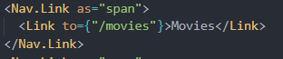

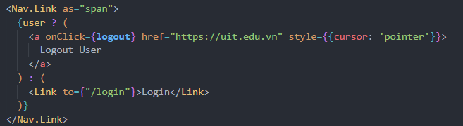

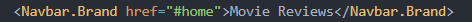

<br>

---

## Bài 3: Thiết lập các định tuyến cho các component vừa tạo ở trên.

<br>

## 3.1 Sử dụng thẻ \<Switch\> hoặc \<Routes\> để định tuyến cho 4 component

**Giải thích:** Import thư viện `Switch`, `Route`, `Link` từ `react-router-dom` và bao bọc các tuyến đường dẫn của ứng dụng vào bên trong thẻ `<Switch>` nằm dưới thanh `<Navbar>`.

<br>

## 3.2 Thiết lập định tuyến bao gồm "/", "/movies/:id/review", "/movies/:id", "/login"

**Giải thích:** Khai báo chi tiết các `<Route>` tương ứng bên trong `<Switch>`: đường dẫn gốc `/` và `/movies` gắn với component `MoviesList`, đường dẫn `/movies/:id/review` truyền thuộc tính sang thẻ `AddReview`, `/movies/:id` hiển thị chi tiết `Movie`, và `/login` gắn với logic đăng nhập trong hàm `Login`.

<br>

**Minh chứng:**

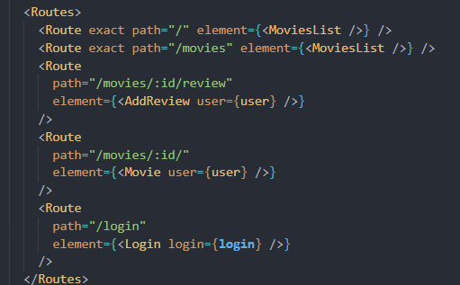

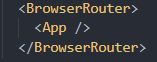

<br>

---

**Mã nguồn:**

```
import React from "react";
import { Routes, Route, Link } from "react-router-dom";
import "bootstrap/dist/css/bootstrap.min.css";

import Nav from "react-bootstrap/Nav";
import Navbar from "react-bootstrap/Navbar";

import AddReview from "./components/add-review";
import MoviesList from "./components/movies-list";
import Movie from "./components/movie";
import Login from "./components/login";

function App() {
const [user, setUser] = React.useState(null);

async function login(user = null) {
// default user to null
setUser(user);
}

async function logout() {
setUser(null);
}

return (
<div className="App">
<Navbar bg="light" expand="lg">
<Navbar.Brand href="#home">Movie Reviews</Navbar.Brand>
<Navbar.Toggle aria-controls="basic-navbar-nav" />
<Navbar.Collapse id="basic-navbar-nav">
<Nav className="me-auto">
<Nav.Link as="span">
<Link to={"/movies"}>Movies</Link>
</Nav.Link>
<Nav.Link as="span">
{user ? (
<a onClick={logout} href="https://uit.edu.vn" style={{cursor: 'pointer'}}>
Logout User
</a>
) : (
<Link to={"/login"}>Login</Link>
)}
</Nav.Link>
</Nav>
</Navbar.Collapse>
</Navbar>

      <Routes>
        <Route exact path="/" element={<MoviesList />} />
        <Route exact path="/movies" element={<MoviesList />} />
        <Route
          path="/movies/:id/review"
          element={<AddReview user={user} />}
        />
        <Route
          path="/movies/:id/"
          element={<Movie user={user} />}
        />
        <Route
          path="/login"
          element={<Login login={login} />}
        />
      </Routes>
    </div>

);
}

export default App;
```

## Khai báo sử dụng AI trí tuệ nhân tạo
