# Báo cáo thực hành Lab 5

| Thông tin     | Chi tiết                                     |
| ------------- | -------------------------------------------- |
| **Họ và tên** | Phạm Viết Đức                                |
| **MSSV**      | 23520314                                     |
| **Môn học**   | IE213.Q21 - Kỹ thuật phát triển hệ thống Web |
| **GVHD**      | ThS. Võ Tấn Khoa                             |

 

---

## Tổng quan bài thực hành

- **Mục tiêu bài thực hành:** Kết nối Frontend (ReactJS) tới Backend API. Thiết lập các biểu mẫu tìm kiếm, hiển thị danh sách phim với các component Bootstrap, xử lý trạng thái với `useState` và `useEffect`, và hiển thị chi tiết phim cùng đánh giá (reviews).
- **Công cụ / môi trường sử dụng:** NodeJS, ReactJS, Axios, Bootstrap, React Router DOM, Moment.js, Visual Studio Code.
- **Cách chạy:**
  1. Mở thư mục chứa dự án `frontend` trong terminal.
  2. Khởi động ứng dụng bằng lệnh `npm start`.
- **Giải thích ngắn gọn phần chính đã thực hiện:**
  - **Bài 1:** Cài đặt `axios` và tạo lớp `MovieDataService` cấu hình gọi API.
  - **Bài 2:** Xây dựng `MoviesList` kết xuất danh sách thẻ phim bằng thẻ `<Card>`, kết hợp thanh tìm kiếm phim và đánh giá.
  - **Bài 3:** Cập nhật trang `Movie` để kết nối hàm lấy thông tin chi tiết của phim từ Backend khi bấm "View Reviews".
  - **Bài 4:** Bổ sung hiển thị giao diện danh sách Reviews phía dưới nội dung Plot của phim, định dạng thời gian bằng `momentjs`.

 

---

## Bài 1: Kết nối tới Backend.

 

## 1.1 Cài đặt axios cho dự án hiện tại.

**Giải thích:** Sử dụng lệnh `npm install axios` để thêm gói thư viện Axios vào dự án, phục vụ cho việc gửi các truy vấn HTTP request tới Backend.

 

**Minh chứng:**

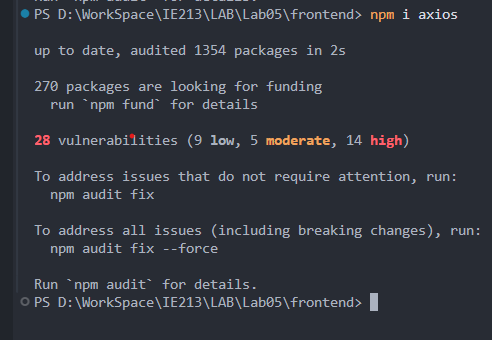

 

## 1.2 & 1.3 Tạo lớp MovieDataService và tạo các lời gọi dịch vụ

**Giải thích:** Khởi tạo tệp `movies.js` trong thư mục `src/services/` với một lớp chứa các phương thức (`getAll`, `get`, `find`, `createReview`, `updateReview`, `deleteReview`, `getRatings`) bọc gọn các API endpoint đã được phát triển trước đó ở Backend.

 

**Minh chứng:**

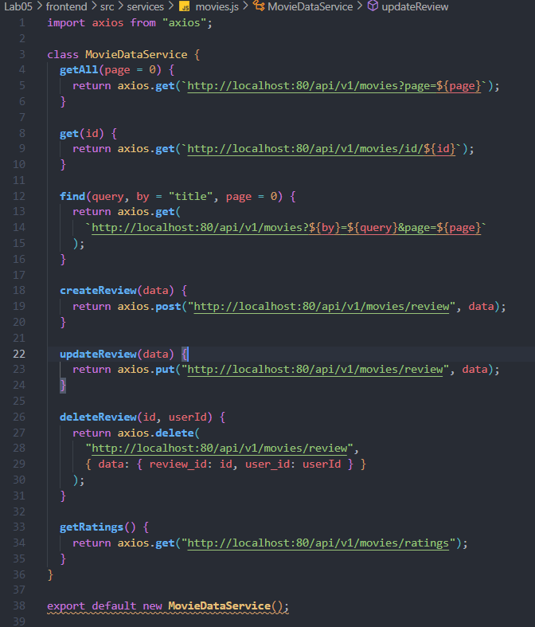

 

---

## Bài 2: Xây dựng MoviesList Component.

 

## 2.1 & 2.2 Tạo biến trạng thái và lấy thông tin movie/ratings với useEffect()

**Giải thích:** Khai báo 4 trạng thái (`movies`, `searchTitle`, `searchRating`, `ratings`) bằng `useState`. Bổ sung hook `useEffect` gọi hàm chức năng lấy dữ liệu khởi tạo thông qua `MovieDataService` sau khi component render xong.

 

**Minh chứng:**

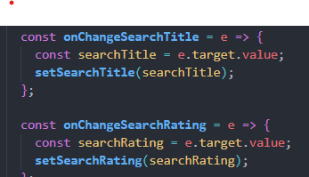
 
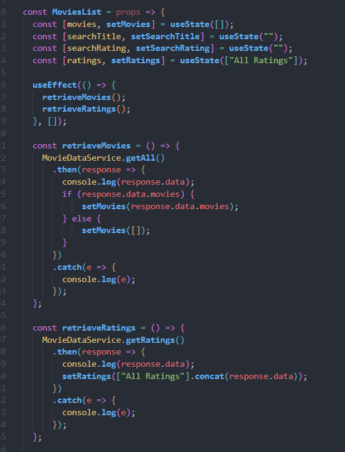

 

## 2.3 Tạo 2 search form tìm theo title và rating.

**Giải thích:** Xây dựng giao diện Form tìm kiếm gồm một ô văn bản (nhập Title) và một trình thả xuống (chọn Rating) bám sát các luồng bắt sự kiện `onChange` lưu vào state.

 

**Minh chứng:**
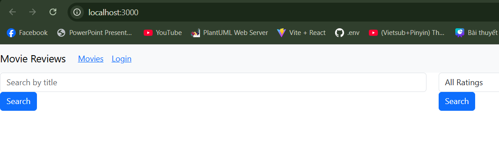
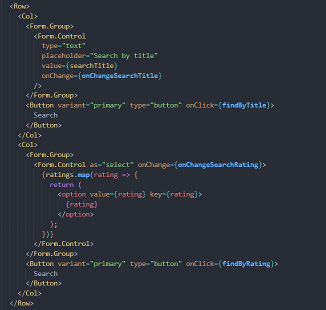

 

## 2.4 Hiển thị các movie bằng \<Card\> của React-bootstrap.

**Giải thích:** Triển khai phương thức lặp mảng `movies.map()` sinh ra các thẻ `<Card>` chứa poster, tiêu đề, xếp hạng (rated), phần tóm tắt (plot), và nút dẫn tới chi tiết phim (View Reviews).

 

**Minh chứng:**

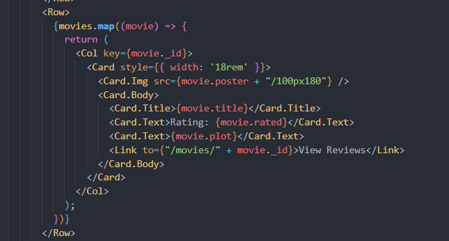

 

## 2.5 Hiện thực phương thức findByTitle() và findByRating().

**Giải thích:** Gọi hàm API `find()` với giá trị từ `searchTitle` hoặc `searchRating` tương ứng. Gắn các hàm này vào nút Search để cập nhật lại danh sách phim hiển thị.

 

**Minh chứng:**

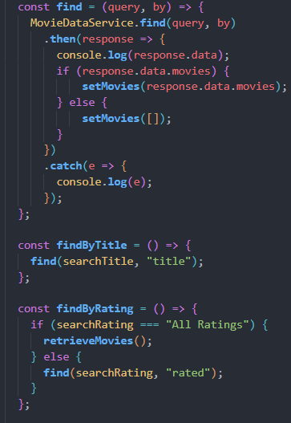
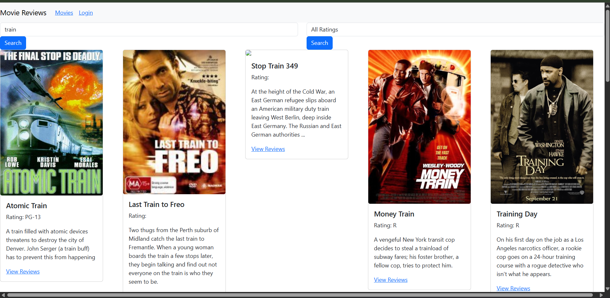

 

---

## Bài 3: Hiển thị thông tin trang movie khi nhấn vào ‘View Reviews’.

 

## 3.1 & 3.2 Thiết lập mã nguồn component Movie và gọi getMovie()

**Giải thích:** Cập nhật file `movie.js` xây dựng một hàm `getMovie(id)` gọi từ Service và gán kết quả trả về vào state `movie`. Hook `useEffect` sẽ giám sát bắt ID trên đường dẫn URL để chủ động gọi hàm.

 

**Minh chứng:**

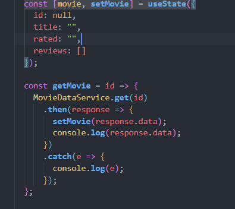

 

## 3.3 Trang trí phần JSX trả về để hiển thị nội dung

**Giải thích:** Xây dựng hệ thống khung lưới `Container`, `Row`, `Col` chứa ảnh bên trái (`Image`) và khung thông tin nội dung chi tiết nằm trên `Card` bên phải.

 

**Minh chứng:**

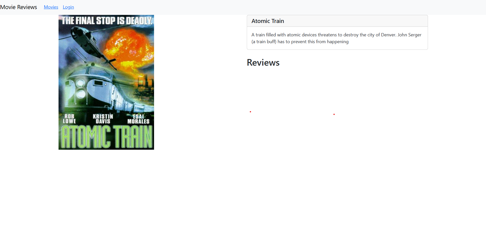
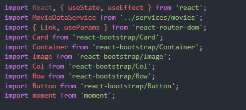
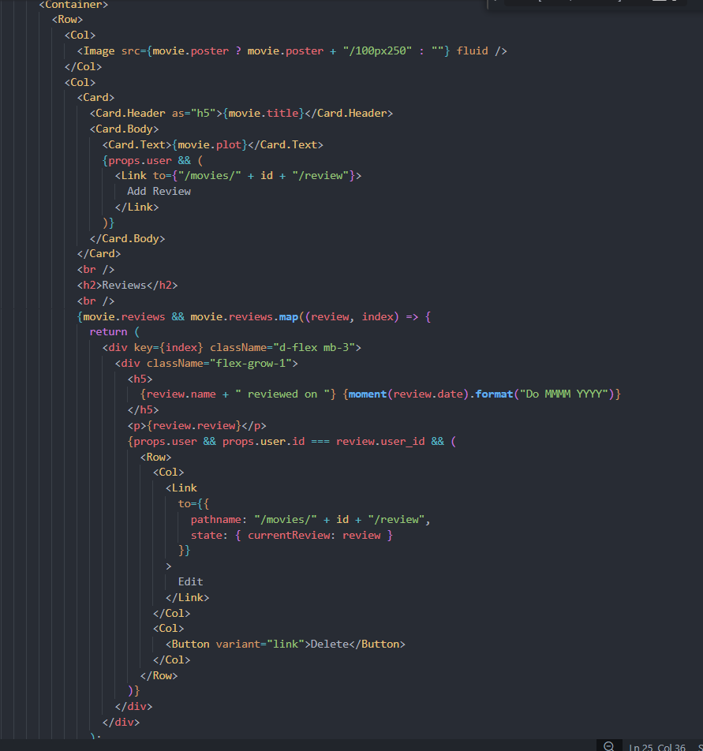

 

---

## Bài 4: Hiển thị danh sách review tương ứng cho từng phim dưới phần Plot.

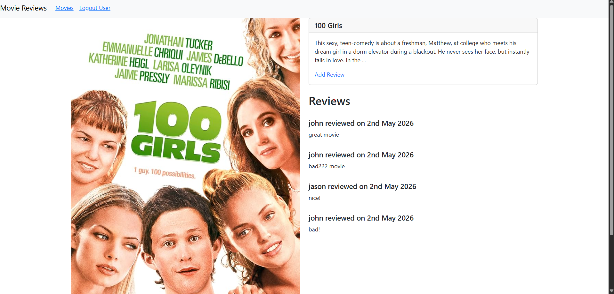

 

## 4.1 Viết đoạn mã nguồn JSX cho phép hiển thị danh sách review cho phim

**Giải thích:** Cập nhật file `movie.js`, sử dụng vòng lặp `map` duyệt qua mảng `reviews` để hiển thị danh sách đánh giá của phim xuống cuối màn hình bằng các thẻ `
` (do thẻ `<Media>` đã bị loại bỏ ở Bootstrap 5). Bổ hiện điều kiện hiện nút Edit/Delete.

 

**Minh chứng:**

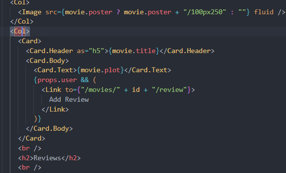

 

## 4.2 Thêm review bằng Postman và định dạng thời gian bằng momentjs

**Giải thích:** Thêm review bằng Postman. Import thư viện `moment` để tùy chỉnh định dạng hiển thị `review.date` thân thiện hơn.

 

**Minh chứng:**

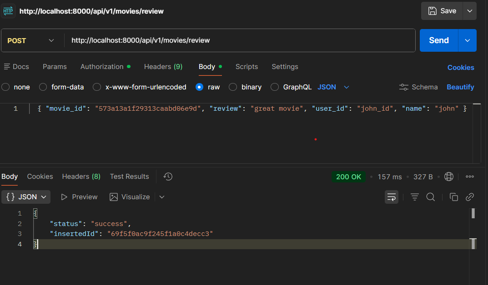
 
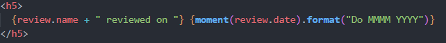

 

---

## Khai báo sử dụng AI trí tuệ nhân tạo

- Dùng AI để phân tích cấu trúc từ file PDF hướng dẫn Lab 5, tạo báo cáo Markdown cho việc triển khai kết nối Frontend-Backend ReactJS.
- Đóng gói mã nguồn tuân thủ logic React Component, State, Effect và React-Bootstrap dựa vào chỉ dẫn.
