# Báo cáo thực hành Lab 6

| Thông tin     | Chi tiết                                     |
| ------------- | -------------------------------------------- |
| **Họ và tên** | Phạm Viết Đức                                |
| **MSSV**      | 23520314                                     |
| **Môn học**   | IE213.Q21 - Kỹ thuật phát triển hệ thống Web |
| **GVHD**      | ThS. Võ Tấn Khoa                             |

 

---

## Tổng quan bài thực hành

- **Mục tiêu bài thực hành:** Hoàn thiện giao diện ứng dụng ReactJS. Bao gồm xử lý đăng nhập, quản lý tính năng thêm/sửa/xoá Review, và lấy dữ liệu phim cho trang tiếp theo (phân trang và tìm kiếm).
- **Công cụ / môi trường sử dụng:** NodeJS, ReactJS, Bootstrap, React Router DOM, Visual Studio Code.
- **Cách chạy:**
  1. Mở thư mục chứa dự án `frontend` trong terminal.
  2. Khởi động ứng dụng bằng lệnh `npm start`.

 

---

## Bài 1: Thêm và Sửa Review.

 

## 1.1 Tạo login component.

**Giải thích:** Xây dựng Component `Login` có 2 trạng thái `name` và `id`. Khi bấm nút Submit, gọi hàm `props.login()` để lưu user và dùng `useNavigate()` chuyển hướng về trang chủ `/`. Việc này mô phỏng đăng nhập để hiển thị chức năng Add/Edit/Delete Review.

 

**Minh chứng:**

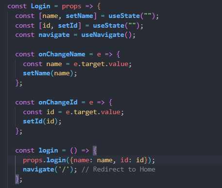

 

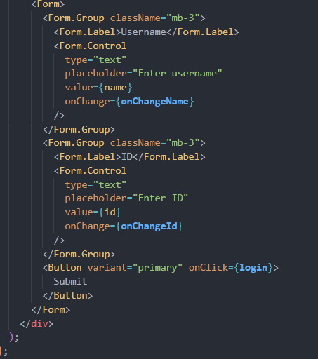

 

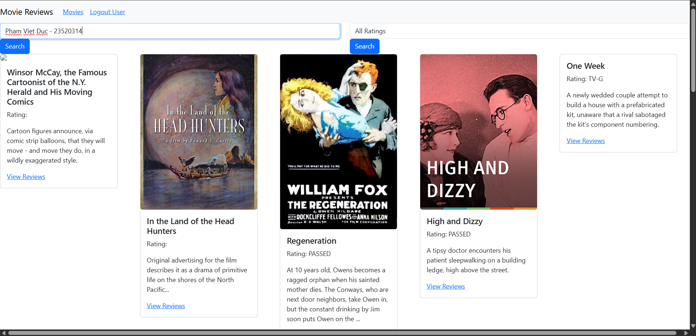

 

## 1.2 Thêm review

**Giải thích:** Trong `add-review.js`, khởi tạo biến trạng thái `editing` và `initialReviewState`. Hàm `saveReview()` sẽ gọi `MovieDataService.createReview()` để đưa dữ liệu mới lên backend, sau đó bật cờ `submitted` để hiển thị thông báo thành công.

 

**Minh chứng:**

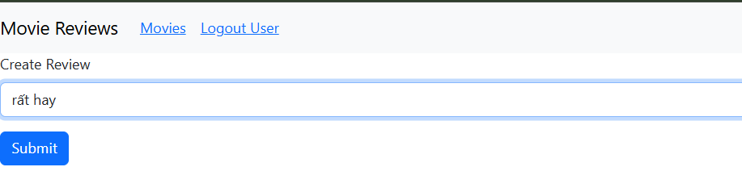

 

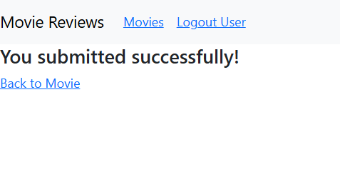

 

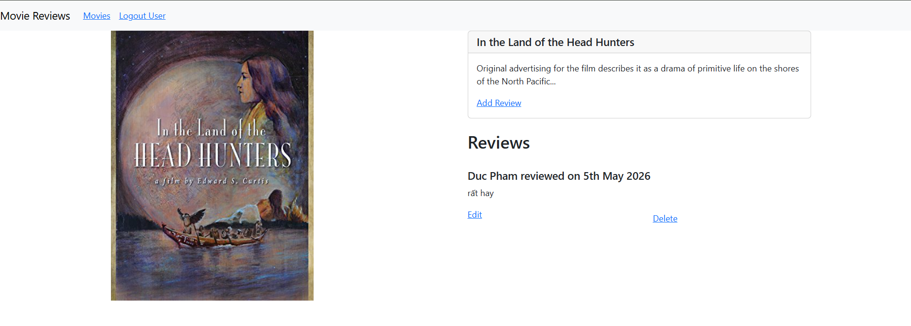

 

## 1.3 Sửa review

**Giải thích:** Cập nhật lại `add-review.js`, dùng lệnh `if (location.state && location.state.currentReview)` để kiểm tra nếu được điều hướng từ nút "Edit". Khi đó gán `editing = true` và gọi `MovieDataService.updateReview()` thay vì tạo mới.

 

**Minh chứng:**

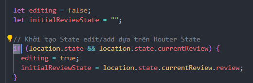

 

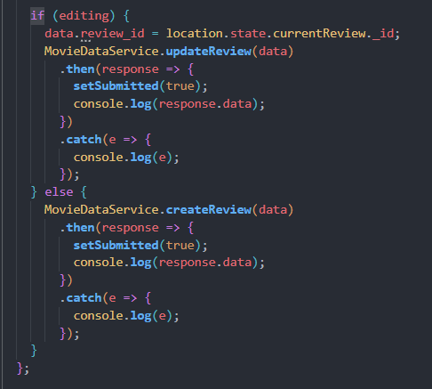

 

---

## Bài 2: Xoá review

**Giải thích:** Thêm logic `deleteReview()` trong `movie.js`. Sau khi gọi API Backend xoá thành công, áp dụng hàm `.splice(index, 1)` để xoá đúng phần tử đó khỏi biến mảng state ảo `movie.reviews`, giúp giao diện biến mất review ngay lập tức mà không cần load lại trang.

 

**Minh chứng:**

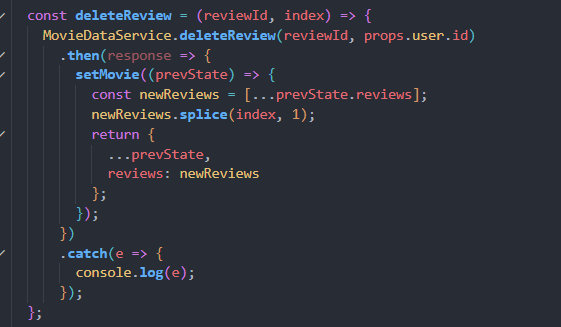

 

---

## Bài 3: Lấy dữ liệu cho trang tiếp theo

 

## 3.1 getAll()

**Giải thích:** Trong `movies-list.js`, thiết lập biến state `currentPage`. Dùng hook `useEffect(() => { retrieveMovies(); }, [currentPage]);` để mỗi khi người dùng bấm nút thay đổi trang thì hàm `retrieveMovies` tự động gửi tham số `currentPage` lên API `getAll` tải thêm phim mới.

 

**Minh chứng:**

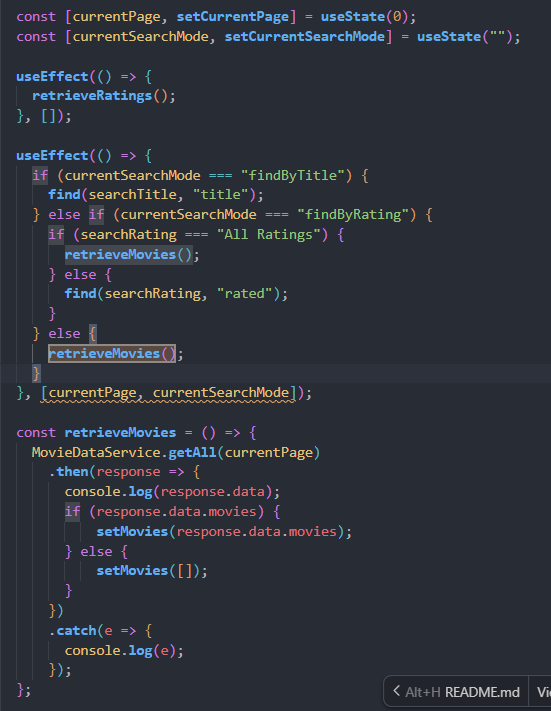

 

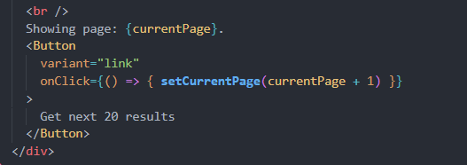

 

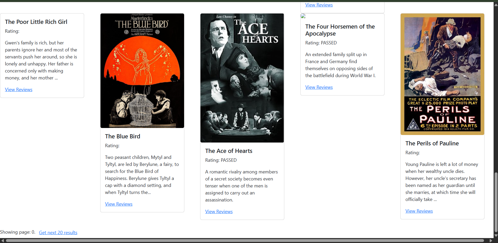

 

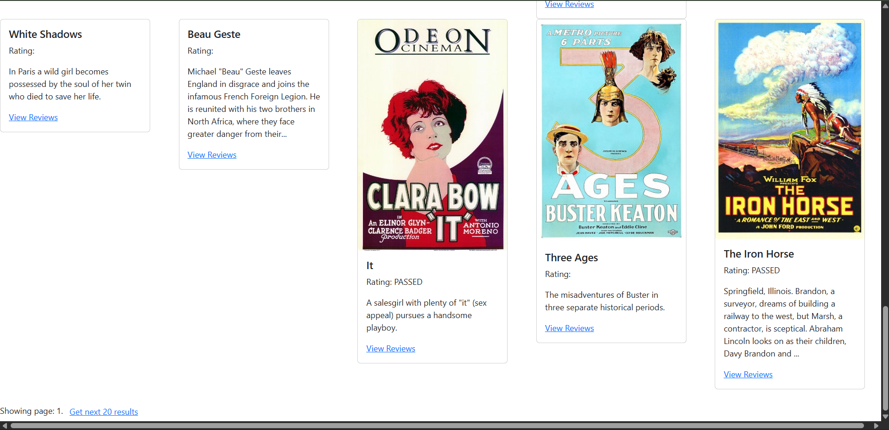

 

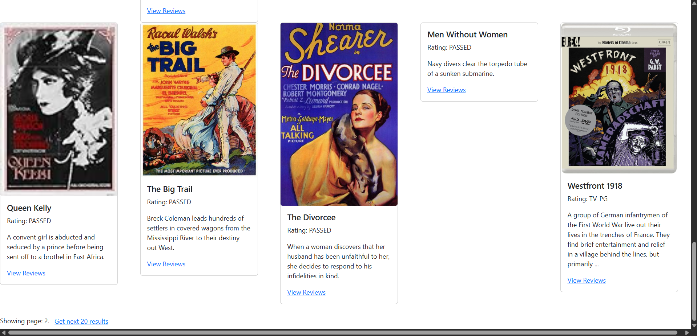

 

## 3.2 find()

**Giải thích:** Thêm biến `currentSearchMode` để lưu ngữ cảnh tìm kiếm (title hoặc rating). Khi biến này đổi, đặt `currentPage = 0`. Cập nhật `retrieveNextPage()` và gọi API `MovieDataService.find(query, by, currentPage)` thay vì `getAll`.

 

**Minh chứng:**

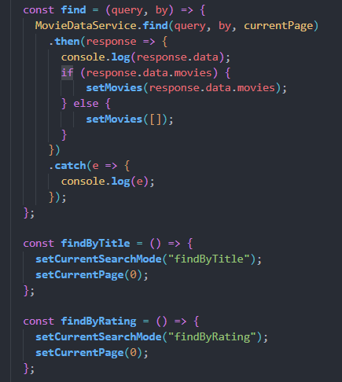

 

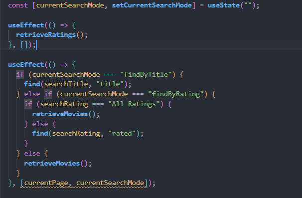

 
